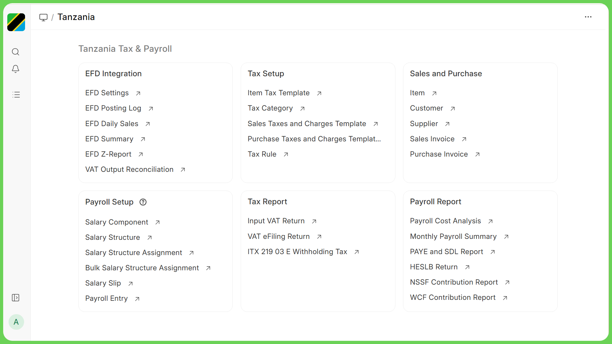
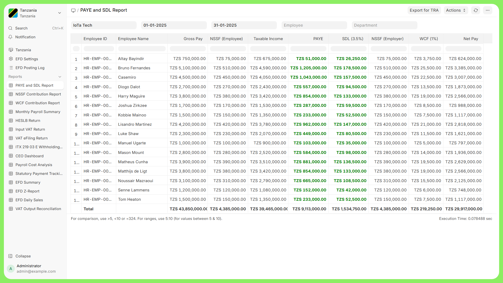
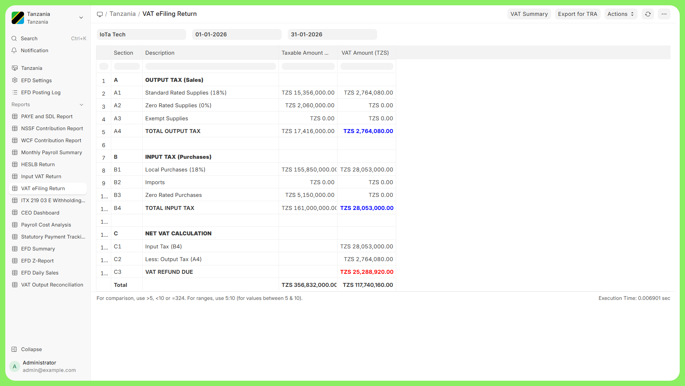
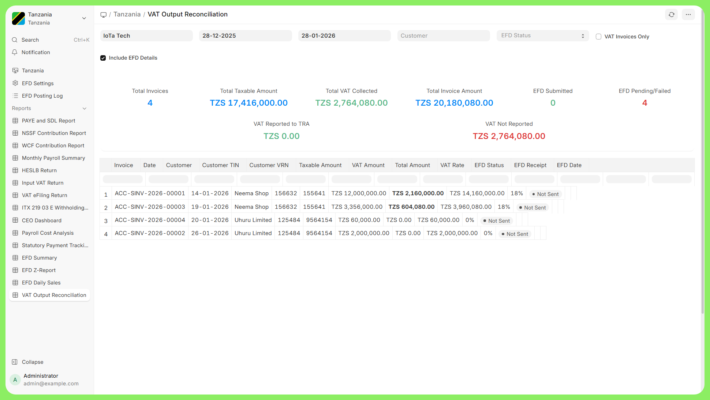
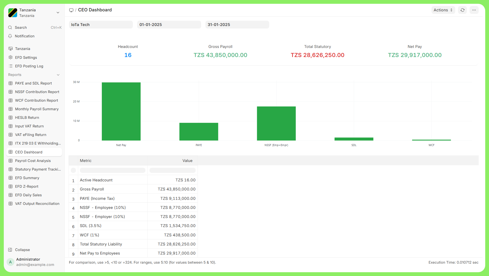
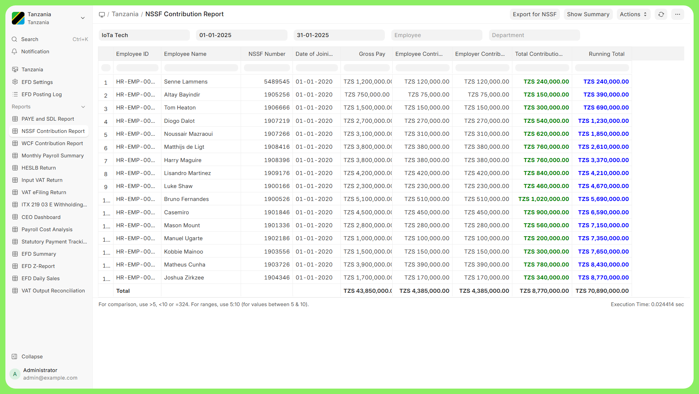
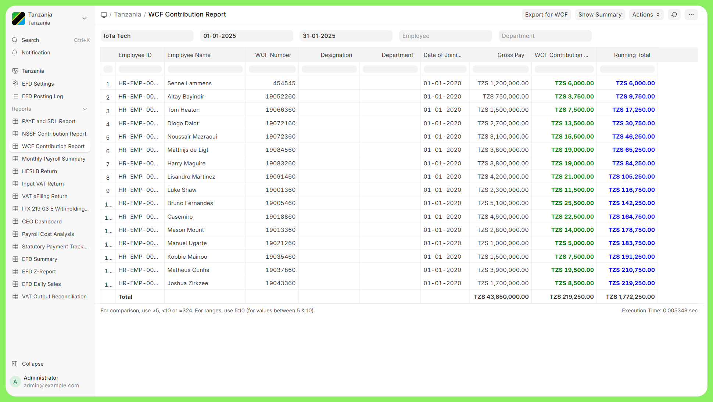
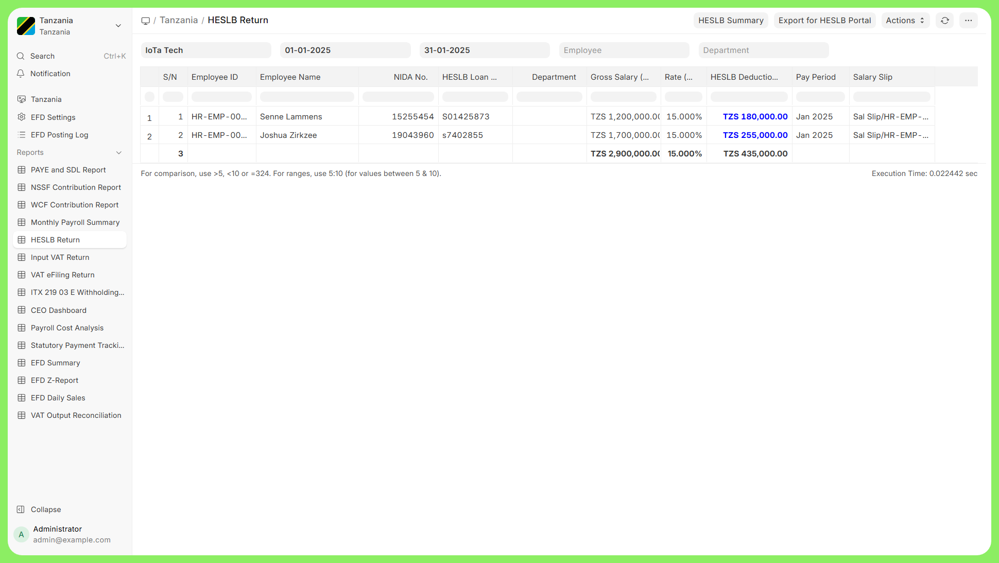
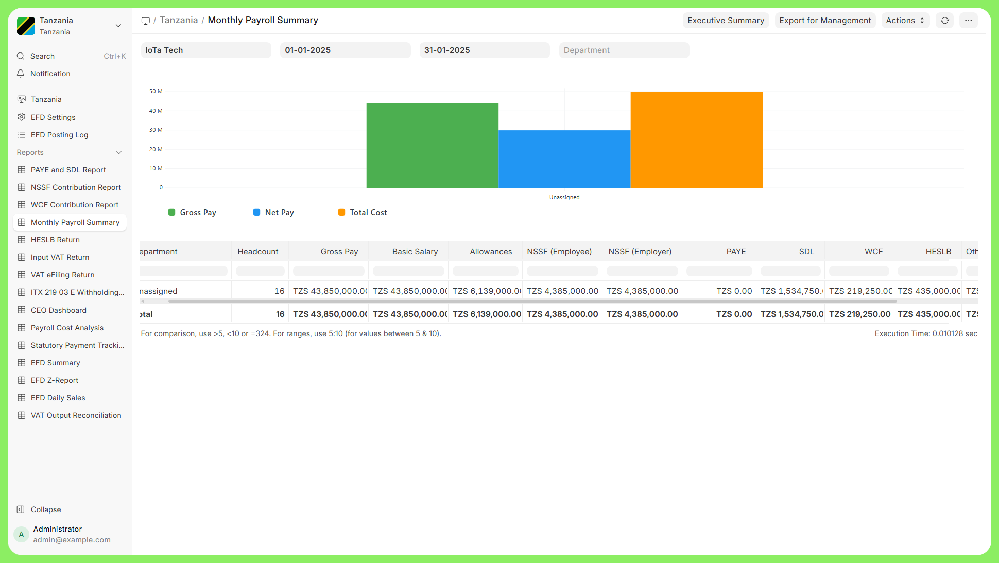
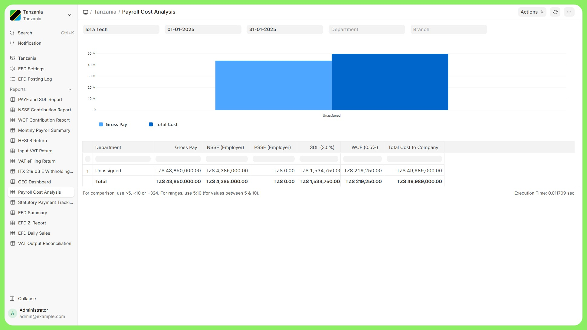

<div align="center">
	<a href="https://github.com/nelsonmpanju/tanzania">
		
	</a>
	<h2>Tanzania Tax & Payroll</h2>
	<p align="center">
		<p>Complete Tax Compliance and Payroll Solution for Tanzanian Businesses</p>
	</p>


</div>

<div align="center">
	
</div>

<div align="center">
	<a href="https://github.com/nelsonmpanju/tanzania">GitHub</a>
	-
	<a href="SETUP.md">Setup Guide</a>
	-
	<a href="#installation">Installation</a>
	-
	<a href="#key-features">Features</a>
	-
	<a href="LICENSE">License</a>
</div>

<div align="center">
<h2>Tanzania Tax & Payroll</h2>
</div>

Tanzania Tax & Payroll is a comprehensive ERPNext application designed specifically for Tanzanian businesses. It provides complete tax compliance with TRA (Tanzania Revenue Authority), seamless EFD (Electronic Fiscal Device) integration, and a full-featured payroll system with all statutory deductions including PAYE, NSSF, PSSF, SDL, WCF, and HESLB.

<div align="center">
<h2> Motivation </h2>
</div>

Tanzanian businesses face unique compliance requirements that generic ERP solutions don't address out of the box. From complex PAYE tax to mandatory EFD receipt submission, businesses need a solution that understands local regulations. This app bridges that gap by providing:

- **TRA Compliance**: Automatic VAT calculations, withholding tax, and e-filing ready reports
- **EFD Integration**: Real-time fiscal receipt submission to TRA through multiple providers
- **Local Payroll**: Complete statutory deductions with proper formulas and tax

<div align="center">
<h2> Key Features </h2>
</div>

### Tax Compliance
- **VAT Management**: 18% standard rate with support for zero-rated, exempt, and special relief categories
- **PAYE Calculation**: 5-bracket progressive taxation (0%, 8%, 20%, 25%, 30%)
- **Withholding Tax**: ITX 219.03.E form generation for TRA submission
- **E-Filing Reports**: VAT returns formatted for TRA portal submission

### EFD Integration
- **Multi-Provider Support**: VFDPlus, TotalVFD, and SimplifyVFD
- **Auto-Submission**: Automatic receipt posting on invoice submission
- **Preview Mode**: Review payload before sending to TRA
- **Retry Mechanism**: Automatic retry for failed submissions every 15 minutes
- **Verification**: Direct links to verify receipts on TRA portal
- **Audit Trail**: Complete logging of all EFD transactions

### Payroll & Statutory Deductions
- **NSSF**: National Social Security Fund (10% employee + 10% employer)
- **PSSF**: Private Sector Pension Fund (5% employee + 15% employer)
- **SDL**: Skills Development Levy (3.5% employer)
- **WCF**: Workers Compensation Fund (0.5% employer)
- **HESLB**: Higher Education Students Loans Board (15% deduction)
- **PAYE**: Automatic tax application with primary/secondary employment support

### Reports (20+ Reports)

<div align="center">
<h2>📊 Report Screenshots</h2>
</div>

#### PAYE and SDL Report
Track employee PAYE deductions and SDL contributions with green-highlighted amounts for easy reading.

<div align="center">

</div>

---

#### VAT eFiling Return
Generate TRA-ready VAT return reports for seamless e-filing submission.

<div align="center">

</div>

---

#### VAT Output Reconciliation
Reconcile VAT output between your books and EFD submissions.

<div align="center">

</div>

---

#### CEO Dashboard
Executive summary of payroll costs, statutory liabilities, and headcount.

<div align="center">

</div>

---

#### NSSF Contribution Report
Track NSSF contributions for both employees and employer.

<div align="center">

</div>

---

#### WCF Contribution Report
Workers Compensation Fund contribution tracking.

<div align="center">

</div>

---

#### HESLB Return
Higher Education Students Loans Board deduction report.

<div align="center">

</div>

---

#### Monthly Payroll Summary
Comprehensive monthly payroll overview.

<div align="center">

</div>

---

#### Payroll Cost Analysis
Detailed analysis of payroll costs including all statutory contributions.

<div align="center">

</div>

---

<details>
<summary><b>All Available Reports</b></summary>

**Tax Reports:**
- VAT Return Report
- VAT eFiling Return
- Input VAT Return
- VAT Output Reconciliation
- Withholding Tax (ITX 219.03.E)

**Payroll Reports:**
- PAYE and SDL Report
- Monthly Payroll Summary
- NSSF Contribution Report
- WCF Contribution Report
- HESLB Return
- Payroll Cost Analysis
- CEO Dashboard

**EFD Reports:**
- EFD Summary
- EFD Daily Sales
- EFD Z-Report

</details>

<div align="center">
<h2> PAYE Tax (Monthly) </h2>
</div>

| Income Range (TZS) | Tax Rate |
|-------------------|----------|
| 0 - 270,000 | 0% |
| 270,001 - 520,000 | 8% |
| 520,001 - 760,000 | 20% |
| 760,001 - 1,000,000 | 25% |
| Above 1,000,000 | 30% |

<div align="center">
 <h2> Installation </h2>
 </div>

### Prerequisites
- ERPNext v15 or later
- Frappe HR v15 or later
- Frappe Framework v15 or later

### Setup

```bash
# Get the app
bench get-app tanzania https://github.com/nelsonmpanju/tanzania.git

# Install on your site
bench --site your-site.local install-app tanzania

# Run migrations
bench migrate

# Build assets
bench build --app tanzania

# Restart bench
bench restart
```

### What Gets Created Automatically

On installation, the app automatically sets up:

- **Tax Accounts**: Output VAT, Input VAT, PAYE Payable, SDL Payable, WCF Payable, HESLB Payable, PSSF Payable
- **Payroll Accounts**: Salary expenses, statutory contribution accounts
- **Salary Components**: 25 pre-configured components with formulas
- **Tax Templates**: Sales and Purchase VAT templates
- **Custom Fields**: Tanzania-specific fields on Employee, Company, Customer, Supplier, Sales Invoice, Purchase Invoice

<h2> Configuration </h2>

### EFD Setup

1. Go to **Tanzania > EFD Integration > EFD Settings**
2. Select your company
3. Choose your EFD provider (VFDPlus, TotalVFD, or SimplifyVFD)
4. Enter API credentials from your provider
5. Click "Fetch Device Info" to retrieve TIN/VRN from TRA
6. Enable auto-submit if desired

### Employee Statutory Details

Each employee can be configured with:
- Pension Fund selection (NSSF or PSSF)
- TIN (Tax Identification Number)
- HESLB loan number (if applicable)
- Pension Fund Number
- WCF Number
- Employment Type (Primary/Secondary for PAYE calculation)

## Custom Fields Added

| DocType | Fields Added |
|---------|-------------|
| Employee | Pension Fund, TIN, HESLB, Pension Fund Number, WCF Number, NIDA, Employment Type |
| Company | TIN, VRN, Tax Office |
| Customer | TIN, VRN, EFD ID Type, Tax Category |
| Supplier | TIN, VRN, Tax Category |
| Sales Invoice | EFD Status, Receipt Number, Verification URL, Skip EFD, Auto Submit |
| Purchase Invoice | Supplier TIN/VRN, Company TIN/VRN |
| Item Tax Template | EFD Tax Code (A/B/C/D/E) |
| Mode of Payment | EFD Payment Type |

## EFD Tax Codes

| Code | Description | Rate |
|------|-------------|------|
| A | Standard Rate | 18% |
| B | Special Rate | Variable |
| C | Zero Rated | 0% |
| D | Special Relief | Reduced |
| E | Exempt | N/A |

## Under the Hood

- [**Frappe Framework**](https://github.com/frappe/frappe): Full-stack web application framework providing database abstraction, authentication, and REST APIs
- [**ERPNext**](https://github.com/frappe/erpnext): Open-source ERP providing core accounting, HR, and payroll functionality

## Project Structure

```
tanzania/
├── tanzania/
│   ├── api/                    # Permission APIs
│   ├── efd/
│   │   ├── providers/          # EFD provider implementations
│   │   │   ├── base.py         # Provider interface
│   │   │   ├── vfdplus.py      # VFDPlus provider
│   │   │   ├── totalvfd.py     # TotalVFD provider
│   │   │   └── simplifyvfd.py  # SimplifyVFD provider
│   │   └── utils.py            # EFD utilities
│   ├── tanzania/
│   │   ├── doctype/            # Custom doctypes
│   │   │   ├── efd_settings/
│   │   │   └── efd_posting_log/
│   │   ├── report/             # 20+ reports
│   │   └── workspace/          # App workspace
│   ├── public/
│   │   ├── images/             # App logo
│   │   └── js/                 # Client scripts
│   ├── hooks.py                # App configuration
│   ├── install.py              # Installation setup
│   ├── custom_fields.py        # Field definitions
│   ├── payroll_setup.py        # Salary components
│   └── payroll_hooks.py        # Payroll events
└── README.md
```

## Contributing

Contributions are welcome! Please feel free to submit a Pull Request.

1. Fork the repository
2. Create your feature branch (`git checkout -b feature/AmazingFeature`)
3. Commit your changes (`git commit -m 'Add some AmazingFeature'`)
4. Push to the branch (`git push origin feature/AmazingFeature`)
5. Open a Pull Request

## License

This project is licensed under the MIT License - see the [LICENSE](LICENSE) file for details.

## Support

- **Issues**: [GitHub Issues](https://github.com/nelsonmpanju/tanzania/issues)
- **Email**: nelsonnorbert87@gmail.com

## Acknowledgments

- [Frappe Technologies](https://frappe.io) for the amazing framework
- [ERPNext Community](https://discuss.erpnext.com) for continuous support
- Tanzania Revenue Authority for EFD documentation

<br />
<br />
<div align="center" style="padding-top: 0.75rem;">
	<p>Made with love for Tanzanian Businesses</p>
	<p>By <a href="https://github.com/nelsonmpanju">Nelson Mpanju</a></p>
</div>
